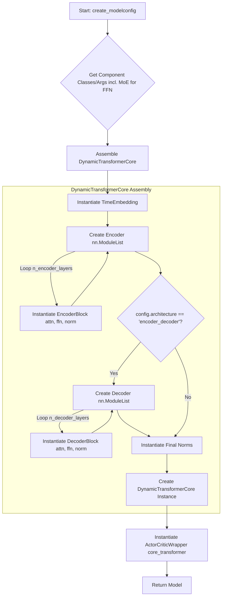

# Model Factory Refactoring Plan

## Goal

Refactor the `training/model_factory.py` to dynamically assemble transformer architectures and components based on a configuration object, rather than selecting pre-defined architecture classes. This allows for greater flexibility in mixing and matching components like attention mechanisms, feed-forward networks (including MoE), and normalization layers.

## Final Plan

1.  **Deprecate MoE Classes:** Remove the redundant `EncoderLayerMoE` and `EncoderOnlyMoE` classes from `rl_agent/agent/transformer/encoder_MOE.py`, as the generic `EncoderBlock` can handle MoE configurations.
2.  **Update `ModelConfig`:** In `training/model_factory.py`:
    *   Remove `"moe"` as a distinct `architecture` type.
    *   Ensure `architecture` only accepts `"encoder_only"` or `"encoder_decoder"`.
    *   Add `n_encoder_layers` and `n_decoder_layers` (with appropriate defaults/handling). Remove the old `n_layers`.
    *   Keep `ffn_type` ("standard", "moe") and related MoE args (`n_experts`, `top_k`) to control FFN choice within blocks.
3.  **Refactor `create_model`:** In `training/model_factory.py`:
    *   Remove the special handling for the MoE architecture.
    *   Implement logic to dynamically assemble a `DynamicTransformerCore` module.
    *   Instantiate `EncoderBlock` (and `DecoderBlock` if needed) using the `attention_class`, `ffn_class` (which could be `FeedForward` or `MixtureOfExperts`), and `norm_class` derived from the config.
4.  **Implement `DynamicTransformerCore`:** Create this new `nn.Module` subclass (e.g., in `model_factory.py` or `rl_agent/agent/transformer/dynamic_core.py`) to:
    *   Hold the assembled lists of encoder/decoder blocks.
    *   Include necessary embeddings (e.g., `TimeEmbedding`).
    *   Include final normalization layers.
    *   Manage the forward pass logic for both encoder-only and encoder-decoder structures based on the provided blocks.
5.  **Clean Up:** Remove unused imports related to the deprecated MoE and potentially other old architecture classes in `model_factory.py` and other relevant files.

## Plan Visualization (Mermaid)

## Confirmation

The user confirmed that with this plan, configuring `architecture="encoder_only"` and `attention_type="mla"` will result in the factory dynamically assembling the model using `EncoderBlock` and `MultiLatentAttention`, without relying on the old pre-defined architecture classes in `rl_agent/agent/transformer/`.
